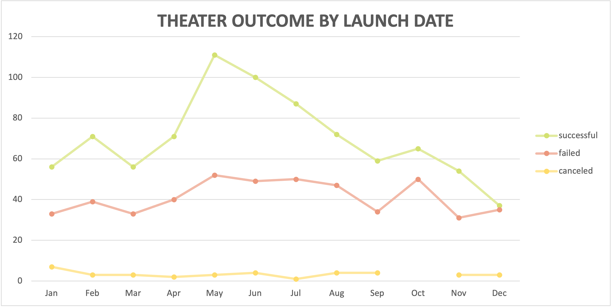
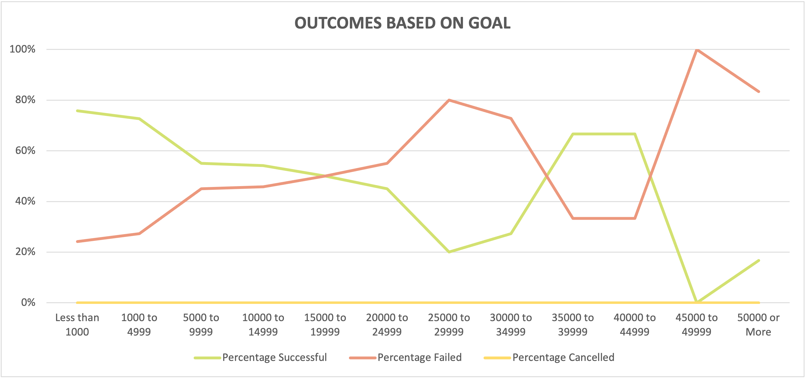

# Kickstarting with Excel

***

## Overview
In this analysis, we visualize Kickstarter campaign outcomes based on their launch dates and funding goals. 

***

### Analysis of Outcomes Based on Launch Date

Campaigns launched in the late spring/early summer had the highestr rate of success. The month of May had significantly higher success rates than any other month. October is a relatively risky month in as it had the highest rate of failure with a relatively low rate of success.

Rate of failure remains fairly consistent throughout the summer months while success rates fall at a steady rate. November and December are statistically the worst months to launch a campaign.

#### Challenges
> *This data was fairly simple to visualize since it was part of the original work done in Module 1.*

#### Limitations
> *This data does not account for individual markets in specific countries. The GB market may be lower volume then US but reflects a higher rate of success in the theater category.*

***

### Analysis of Outcomes Based on Goals

Campaigns with low goals had the highest rate of success, with the most successful funding goals being less than $5,000. As funding goals increase, rate of success steadily decreases then becomes unpredictable over $35,000.

#### Challenges
> I had some trouble with the `=COUNTIFS` function and spent some time attempting to create nested `=IF` statements because I didn't fully comprehend the difference between `=COUNTIF` and `=COUNTIFS`.

> I also thought I had done something wrong in my formulas because all canceled cells returned a 0 value, but was able to confirm the data was showing correctly by looking at column filters on the tab of data and saw there were indeed zero canceled campaigns. Because there were no canceled campaigns, it felt unnecessary to graph the failed campaigns, as the failed graph was just a mirror of the successful ones and didn't offer any new information. 

#### Limitations
> *Higher goal campaigns appear to be much riskier and show inconsistent rates of success, but the data is a much smaller sample size and the data may be unreliable as a result. See below table:*

>| Goal in USD | Total Projects | Successful | 
>| :---: | :---: | :---: |
>| Less than 1000 | 186 | 76% |
>| 1000 to 4999 | 534 | 73% |
>| 5000 to 9999 | 169 | 55% |
>| 10000 to 14999 | 72 | 54% |
>| 15000 to 19999 | 24 | 50% |
>| 20000 to 24999 | 20 | 45% |
>| 25000 to 29999 | 5 | 20% |
>| 30000 to 34999 | 11 | 27% |
>| 35000 to 39999 | 6 | 67% |
>| 40000 to 44999 | 3 | 67% |
>| 45000 to 49999 | 1 | 0%
>| 50000 or More | 12 | 17% |

***

## Looking forward

### Data worth future analysis:
1. Effect of Kickstarter feature status on success of campaign

- *Does Kickstarter "Staff Pick" or "Spotlight" features have an impact on which campaigns succeed?* 

2. Filter data by country

- *Some markets show a higher interest in theater than others, does more specific data create different conclusions?*

3. Trends over time

- *Is Kickstarter annual donation volume increasing in general?*
- *Are plays becoming more or less successful each year?*

4. Sub-subcategories

- *Are certain types of plays more successful than others?*
