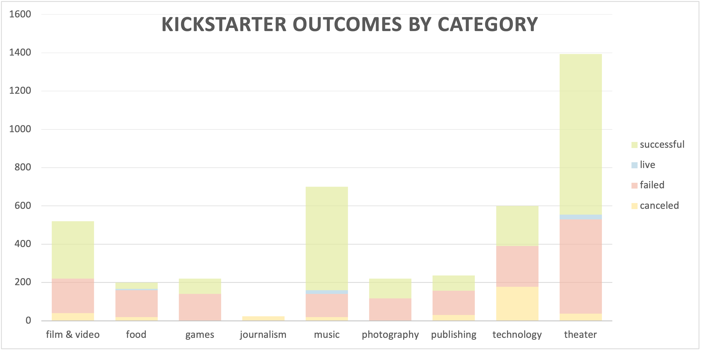
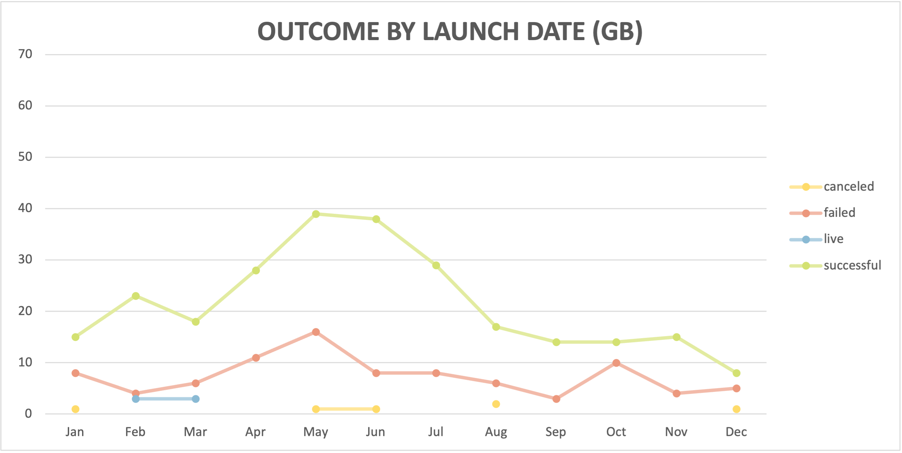

# **An analysis of Kickstarter Campaigns in the US and UK**

## **Overall Category Analysis**

Of all the types of campaigns worldwide on Kickstarter, those in the theater category tend to be the most successful.

In the United States, theater campaigns account for nearly 32% of all successful campaigns, whereas in Great Britain, they account for over 70% of all successful Kickstarter campaigns. 

 

## **Theater Category Analysis**

In the *Theater* category, plays are by and far the most popular subcategory, making up more than the *Musical* and *Theater Spaces* categories combined in both the US and GB. 

 

## **Success Based on Launch Date**

In both the US and GB, campaigns launched in the month of May had significantly higher success rates than any other month. 

October is the riskiest month in both markets as it had the highest rate of failure. February is also a risky month in the US for these types of campaigns.

 
